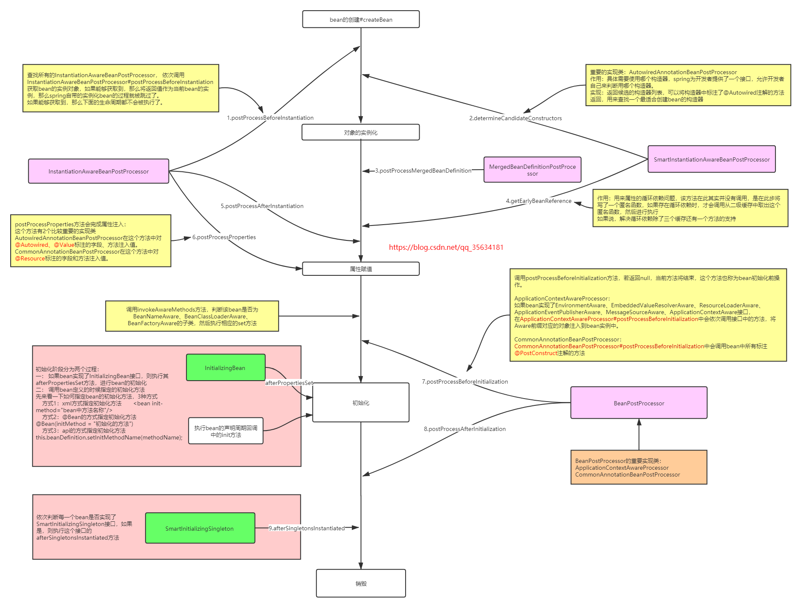

# 一.Spring简介

## 1.Spring家族

- 官网：https://spring.io
- Spring发展到今天已经形成了一种开发的生态圈，Spring提供了若干个项目，每个项目用于完成特定的功能。

## 2.Spring发展史

## 3.Spring Framework系统架构

Spring Framework是Spring生态圈中最基础的项目，是其他项目的根基

# 二.Spring核心概念

## 1.IOC

**IOC（Inversion of Control）控制反转**：

- 使用对象时，由主动new产生对象转换为由==外部==提供对象，此过程中对象创建控制权由程序转移到外部，此思想称为控制反转。通俗的讲就是“==将new对象的权利交给Spring，我们从Spring中获取对象使用即可==”
- Spring技术对IoC思想进行了实现：Spring提供了一个容器，称为==IOC容器==，用来充当IoC思想中的“外部”；IOC容器负责对象的创建、初始化等一系列工作，被创建或被管理的对象在IoC容器中统称为==Bean==

**bean的生命周期**：

**spring拓展接口**：

## 2.DI

**DI（Dependency Injection）依赖注入**：在容器中建立bean与bean之间的依赖关系的整个过程，称为依赖注入。

## 3.AOP

**AOP(Aspect Oriented Programming)面向切面编程**是一种编程范式，指导开发者如何组织程序结构

- 作用：在不惊动原始设计的基础上为其进行功能增强。简单的说就是在不改变方法源代码的基础上对方法进行功能增强。
- Spring理念：无入侵式/无侵入式。
- 实现：AOP运用的是动态代理模式。

- aop实现：

  

  - 连接点（JoinPoint）：正在执行的方法，例如：select()、delete()、show()等都是连接点。
  - 切入点（Pointcut）：进行功能增强了的方法，例如:delete()方法，select()，show()方法没有被增强所以不是切入点，但是是连接点。
    - 在SpringAOP中，一个切入点可以只描述一个具体方法，也可以匹配多个方法
      - 一个具体方法：com.dengzhihong.AOP.dao包下的BookDao接口中的无形参无返回值的delete()方法
      - 匹配多个方法：需要设置切入点表达式，由  *或..和+占位符表示。
  - 通知（Advice）：在切入点前后执行的操作，也就是增强的共性功能
    - 在SpringAOP中，功能最终以方法的形式呈现
  - 通知类：通知方法所在的类叫做通知类
  - 切面（Aspect）：描述通知与切入点的对应关系，也就是哪些通知方法对应哪些切入点方法。

## 4.Spring事务

### 4.1 Spring事务管理

作用：在数据层保障一系列的数据库操作同成功同失败

实现：使用动态代理实现

Spring事务角色：

- 事务管理员：发起事务方，在Spring中通常指代业务层开启事务的方法
- 事务协调员：加入事务方，在Spring中通常指代数据层方法，也可以是业务层方法

**Spring事务的回滚机制配置**：

> 说明：对于RuntimeException类型异常或者Error错误，Spring事务能够进行回滚操作。但是对于编译器异常，Spring事务是不进行回滚的，所以需要使用rollbackFor来设置要回滚的异常。

**事务回滚失效情况**：

1. Spring的AOP即声明式事务管理默认是针对unchecked exception回滚。如果一个方法，不仅作为切点添加了异常切面，而且还添加了事务，那么当这个方法抛出异常时，总是切面先捕获到异常，并且吞掉了这个异常。而事务是捕获不到这个异常的，因此事务是不生效的。
2. Spring的事务边界是在调用业务方法之前开始的，业务方法执行完毕之后来执行commit or rollback(Spring默认取决于是否抛出runtimeException)。
3. 如果你在方法中有try{}catch(Exception e){}处理，那么try里面的代码块就脱离了事务的管理，若要事务生效需要在catch中throw new RuntimeException ("xxx")。
4. 对于RuntimeException类型异常或者Error错误，Spring事务能够进行回滚操作。但是对于编译器异常，Spring事务是不进行回滚的，所以需要使用rollbackFor来设置要回滚的异常。

### 4.2 事务传播行为

事务协调员对事务管理员所携带事务的处理态度，在开始当前事务之前，一个事务上下文已经存在，此时有若干选项可以指定一个事务性方法的执行行为。

在TransactionDefinition定义传播行为的常量：

1. TransactionDefinition.PROPAGATION_REQUIRED：如果当前存在事务，则加入该事务；如果当前没有事务，则创建一个新的事务。这是默认值。

2. TransactionDefinition.PROPAGATION_REQUIRES_NEW：创建一个新的事务，如果当前存在事务，则把当前事务挂起。

3. TransactionDefinition.PROPAGATION_SUPPORTS：如果当前存在事务，则加入该事务；如果当前没有事务，则以非事务的方式继续运行。

4. TransactionDefinition.PROPAGATION_NOT_SUPPORTED：以非事务方式运行，如果当前存在事务，则把当前事务挂起。

5. TransactionDefinition.PROPAGATION_NEVER：以非事务方式运行，如果当前存在事务，则抛出异常。

6. TransactionDefinition.PROPAGATION_MANDATORY：如果当前存在事务，则加入该事务；如果当前没有事务，则抛出异常。

7. TransactionDefinition.PROPAGATION_NESTED：如果当前存在事务，则创建一个事务作为当前事务的嵌套事务来运行；如果当前没有事务，则该取值等价于第1条。