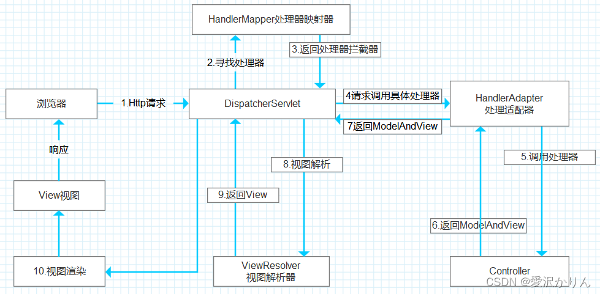

# 一.SpringMVC简介

SpringMVC是一种基于Java实现MVC模型的轻量级Web框架。

优点：

1. 使用简单，开发便捷（相比于Servlet）
2. 灵活性强

# 二.SpringMVC组成

由**处理器映射**、处理器(控制器)、 DispatcherServlet、**视图解析器**、视图组成。

1、用户发送请求至前端控制器DispatcherServlet

2、DispatcherServlet收到请求调用HandlerMapping处理器映射器。

3、处理器映射器根据请求url找到具体的处理器，生成处理器对象Handler及处理器拦截器(如果有则生成)一并返回给DispatcherServlet。

4、DispatcherServlet通过HandlerAdapter（让Handler实现更加灵活）处理器适配器调用处理器

5、执行处理器(Controller，也叫后端控制器)。

6、Controller执行完成返回ModelAndView（连接业务逻辑层和展示层的桥梁，持有一个ModelMap对象和一个View对象）。

7、HandlerAdapter将controller执行结果ModelAndView返回给DispatcherServlet

8、DispatcherServlet将ModelAndView传给ViewReslover视图解析器

9、ViewReslover解析后返回具体View

10、DispatcherServlet对View进行渲染视图（将ModelMap模型数据填充至视图中）。

11、DispatcherServlet响应用户

# 三.SpringMVC拦截器

## 1.拦截器概念和作用

- 拦截器（Interceptor）是一种动态拦截方法调用的机制，在SpringMVC中动态拦截控制器方法的执行
- 作用：
  1. 在指定的方法调用前后执行预先设定的代码
  2. 阻止原始方法的执行
  3. 总结：增强
- 核心原理：AOP思想

## 2.拦截器和过滤器的区别

- 归属不同：Filter属于Servlet技术，Interceptor属于SpringMVC技术
- 拦截内容不同：Filter对所有访问进行增强，Interceptor仅针对SpringMVC的访问进行增强

## 3.拦截器流程分析

单拦截器：

多个连接器：

- 当配置多个拦截器时，形成拦截器链
- 拦截器链的运行顺序参照拦截器添加顺序为准
- 当拦截器中出现对原始处理器的拦截，后面的拦截器均终止运行
- 当拦截器运行中断，仅运行配置在前面的拦截器的afterCompletion操作

